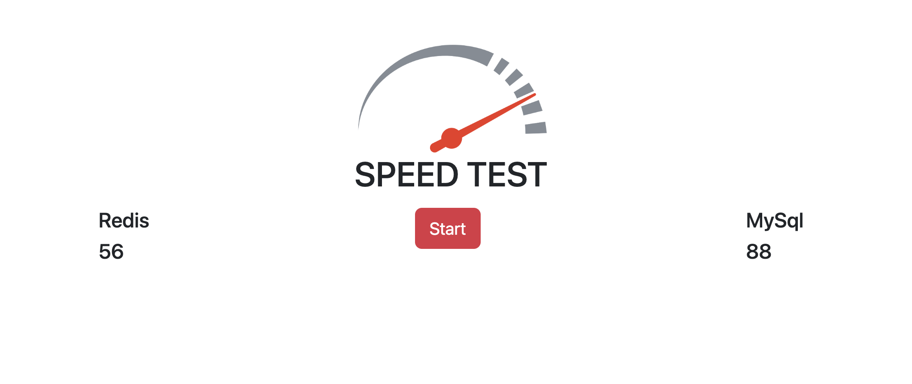

## Финальный проект модуля 4
___
Информация по **проекту**:
1. Версия jdk - 18.
2. Tomcat 10.
3. Поднять mysql "docker run --rm --name mysql -e MYSQL_ROOT_PASSWORD=qwerty -d -p 3306:3306 mysql:latest".
4. Поднять redis "docker run -d --name redis-stack -p 6379:6379 -p 8001:8001 redis/redis-stack:latest".
5. Hibernate configuration - resources/hibernate.properties.
6. Sql-script - resources/sql.sql

Приложение **умеет** сравнивать скорость получения информации из **REDIS** и **MYSQL**

